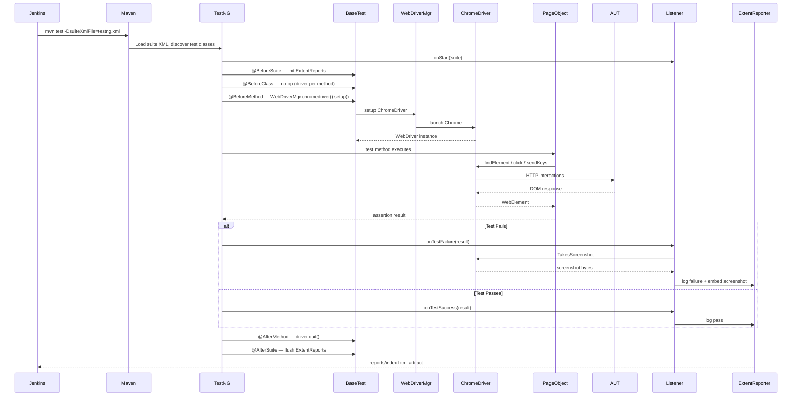

# Design Document

## AI-Driven Ecommerce Automation Framework

---

## Overview

This document describes the technical design for the AI-Driven Ecommerce Automation Framework targeting the Advantage Online Shopping application (https://advantageonlineshopping.com). The framework is built with **Java + Selenium WebDriver**, **TestNG**, and the **Page Object Model (POM)** design pattern, and integrates with Kiro's AI-assisted engineering capabilities (Spec Mode, Steering, Hooks) to accelerate test development and enforce coding standards.

### Goals

- Provide a scalable, maintainable UI automation framework for the AUT.
- Enforce separation of concerns between page interaction logic (Page Objects) and test logic (Test Classes).
- Support parallel execution, data-driven testing, retry logic, and rich HTML reporting.
- Integrate seamlessly with Jenkins CI/CD pipelines.
- Leverage Kiro Steering and Hooks to keep AI-generated code consistent with framework conventions.

### Technology Stack

| Concern | Technology |
|---|---|
| Language | Java 11+ |
| Browser Automation | Selenium WebDriver 4.x |
| Driver Management | WebDriverManager (io.github.bonigarcia) |
| Test Framework | TestNG 7.x |
| Build Tool | Maven |
| Reporting | ExtentReports 5.x |
| Logging | Log4j2 |
| Test Data | JSON / `.properties` files |
| CI/CD | Jenkins (Declarative Pipeline) |
| AI Assistance | Kiro (Spec Mode, Steering, Hooks) |

### Design Principles

1. **Page Object Model** — one class per AUT page, encapsulating all locators and interaction methods.
2. **Explicit Waits** — `WebDriverWait` + `ExpectedConditions` for all synchronization; no `Thread.sleep()`.
3. **CSS-First Locators** — CSS selectors preferred; ARIA/ID as fallback; XPath only when no alternative exists.
4. **Externalized Test Data** — no hardcoded values in test or page classes; all data sourced from `testdata/`.
5. **Listener-Driven Reporting** — `ITestListener` integration with ExtentReports and screenshot capture.
6. **Retry on Transient Failure** — `IRetryAnalyzer` retries failed tests up to 2 times.

---

## Architecture

### Component Diagram

```mermaid
graph TD
    subgraph CI["CI/CD Layer"]
        JK[Jenkins Pipeline]
        MVN[Maven Surefire Plugin]
    end

    subgraph TestNG["TestNG Execution Layer"]
        SUITE[TestNG Suite XML<br/>testng.xml / smoke / regression]
        LISTENER[TestNG Listener<br/>ITestListener]
        RETRY[RetryAnalyzer<br/>IRetryAnalyzer]
    end

    subgraph Tests["Test Layer — src/test/java/tests/"]
        LT[LoginTest]
        ST[SearchTest]
        PT[ProductTest]
        CT[CartTest]
        CHT[CheckoutTest]
    end

    subgraph Base["Base Layer — src/test/java/base/"]
        BT[BaseTest<br/>@BeforeSuite / @AfterSuite<br/>@BeforeClass / @AfterClass<br/>@BeforeMethod / @AfterMethod]
    end

    subgraph Pages["Page Layer — src/test/java/pages/"]
        LP[LoginPage]
        SP[SearchPage]
        PP[ProductPage]
        CAP[CartPage]
        CHP[CheckoutPage]
    end

    subgraph Utils["Utility Layer — src/test/java/utils/"]
        WDM[WebDriverManager<br/>Driver Factory]
        SS[ScreenshotUtility]
        TDP[TestDataProvider]
        ER[ExtentReporter]
    end

    subgraph Data["Test Data — testdata/"]
        JSON[testdata.json]
        PROPS[config.properties]
    end

    subgraph Browser["Browser Layer"]
        WD[Selenium WebDriver<br/>ChromeDriver]
        AUT[AUT — Advantage Online Shopping]
    end

    JK --> MVN --> SUITE
    SUITE --> LISTENER
    SUITE --> Tests
    Tests --> BT
    BT --> WDM --> WD --> AUT
    Tests --> Pages
    Pages --> WD
    LISTENER --> ER
    LISTENER --> SS
    Tests --> TDP --> Data
    RETRY -.->|retries| Tests
```

### Execution Flow Sequence Diagram



---

## Components and Interfaces

### BaseTest (`src/test/java/base/BaseTest.java`)

The root class for all test classes. Manages the WebDriver lifecycle via TestNG lifecycle annotations.

```java
public class BaseTest {
    protected WebDriver driver;
    protected WebDriverWait wait;

    @BeforeSuite
    public void initSuite() { /* init ExtentReports */ }

    @BeforeMethod
    public void setUp(Method method) {
        // WebDriverManager auto-downloads and configures ChromeDriver
        WebDriverManager.chromedriver().setup();
        ChromeOptions options = new ChromeOptions();
        // headless flag from config.properties
        driver = new ChromeDriver(options);
        driver.manage().window().maximize();
        wait = new WebDriverWait(driver, Duration.ofSeconds(10));
        ExtentReporter.startTest(method.getName());
    }

    @AfterMethod
    public void tearDown(ITestResult result) {
        if (result.getStatus() == ITestResult.FAILURE) {
            ScreenshotUtility.capture(driver, result.getName());
        }
        if (driver != null) driver.quit();
        ExtentReporter.endTest(result);
    }

    @AfterSuite
    public void tearDownSuite() { ExtentReporter.flush(); }
}
```

**Key responsibilities:**
- Instantiate `ChromeDriver` via `WebDriverManager` before each test method.
- Provide a shared `WebDriverWait` instance (10 s default, 15 s for checkout).
- Delegate screenshot capture and report logging to utilities on failure.
- Quit the driver after every test method to ensure isolation.

---

### LoginPage (`src/test/java/pages/LoginPage.java`)

Encapsulates all locators and interactions for the AUT login page.

| Method | Signature | Description |
|---|---|---|
| `login` | `HomePage login(String username, String password)` | Enters credentials and submits the form. Returns the resulting page. |
| `getErrorMessage` | `String getErrorMessage()` | Returns the visible error message text after a failed login. |
| `isOnLoginPage` | `boolean isOnLoginPage()` | Returns `true` if the login form is currently visible. |

**Locator strategy:**
- Username field: `By.cssSelector("input[name='username']")`
- Password field: `By.cssSelector("input[name='password']")`
- Submit button: `By.cssSelector("button[type='submit']")`
- Error message: `By.cssSelector(".login-error-message")`

**Wait strategy:** `WebDriverWait.until(ExpectedConditions.visibilityOfElementLocated(...))` with 10 s timeout; throws `TimeoutException` with descriptive message on expiry.

---

### SearchPage (`src/test/java/pages/SearchPage.java`)

Encapsulates product search interactions.

| Method | Signature | Description |
|---|---|---|
| `searchFor` | `SearchResultsPage searchFor(String term)` | Enters the term in the search input and submits. |
| `getNoResultsMessage` | `String getNoResultsMessage()` | Returns the no-results message text. |
| `clickResult` | `ProductPage clickResult(String productName)` | Clicks the named result item. |

**Locator strategy:**
- Search input: `By.cssSelector("input[name='searchTerm']")`
- Search button: `By.cssSelector("button.search-btn")`
- Result items: `By.cssSelector(".product-list-item")`
- No-results message: `By.cssSelector(".no-results-message")`

---

### ProductPage (`src/test/java/pages/ProductPage.java`)

Encapsulates product category and detail page interactions.

| Method | Signature | Description |
|---|---|---|
| `selectProduct` | `ProductPage selectProduct(String productName)` | Clicks the named product to open its detail view. |
| `getProductDetails` | `ProductDetails getProductDetails()` | Returns a `ProductDetails` object with name, price, description, quantity. |
| `getCategoryProducts` | `List<String> getCategoryProducts()` | Returns names of all products in the current category. |

**Locator strategy:**
- Product name: `By.cssSelector("h1.product-name")`
- Product price: `By.cssSelector("span.product-price")`
- Product description: `By.cssSelector("div.product-description")`
- Quantity: `By.cssSelector("span.product-quantity")`

---

### CartPage (`src/test/java/pages/CartPage.java`)

Encapsulates shopping cart interactions.

| Method | Signature | Description |
|---|---|---|
| `addToCart` | `CartPage addToCart(String productName, int quantity)` | Adds the specified product and quantity to the cart. |
| `getCartItemCount` | `int getCartItemCount()` | Returns the current cart item count from the cart badge. |
| `getCartItems` | `List<CartItem> getCartItems()` | Returns all items currently in the cart. |
| `updateQuantity` | `CartPage updateQuantity(String productName, int newQty)` | Updates the quantity for the named cart item. |
| `getLineItemTotal` | `double getLineItemTotal(String productName)` | Returns the calculated line item total for the named product. |

**Locator strategy:**
- Cart badge: `By.cssSelector("span.cart-count")`
- Cart items: `By.cssSelector("div.cart-item")`
- Add to cart button: `By.cssSelector("button.add-to-cart")`
- Quantity input: `By.cssSelector("input.item-quantity")`

---

### CheckoutPage (`src/test/java/pages/CheckoutPage.java`)

Encapsulates checkout flow interactions.

| Method | Signature | Description |
|---|---|---|
| `proceedToCheckout` | `CheckoutPage proceedToCheckout()` | Navigates from the cart to the first checkout step. |
| `getOrderSummary` | `List<OrderLineItem> getOrderSummary()` | Returns the order summary as a list of `OrderLineItem` objects. |
| `isCheckoutPageLoaded` | `boolean isCheckoutPageLoaded()` | Returns `true` if all required checkout form sections are visible. |

**Wait strategy:** 15 s `WebDriverWait` for checkout page load; throws `TimeoutException` with descriptive message on expiry.

---

### ScreenshotUtility (`src/test/java/utils/ScreenshotUtility.java`)

| Method | Signature | Description |
|---|---|---|
| `capture` | `String capture(WebDriver driver, String testName)` | Captures a full-page screenshot, saves to `screenshots/{testName}_{timestamp}.png`, returns the file path. |

---

### TestDataProvider (`src/test/java/utils/TestDataProvider.java`)

| Method | Signature | Description |
|---|---|---|
| `getData` | `String getData(String key)` | Returns the string value for the given key from the active data file. Throws `TestDataNotFoundException` if key is absent. |
| `getDataProvider` | `@DataProvider Object[][] getDataProvider(String dataSetName)` | Returns a 2D array for use with TestNG `@DataProvider`. |

---

### ExtentReporter (`src/test/java/utils/ExtentReporter.java`)

Thread-safe wrapper around the ExtentReports 5.x API.

| Method | Signature | Description |
|---|---|---|
| `startTest` | `void startTest(String testName)` | Creates a new `ExtentTest` node for the current thread. |
| `log` | `void log(Status status, String message)` | Logs a step with the given status. |
| `embedScreenshot` | `void embedScreenshot(String screenshotPath)` | Embeds the screenshot at the given path into the current test node. |
| `endTest` | `void endTest(ITestResult result)` | Marks the test node as pass/fail/skip based on the TestNG result. |
| `flush` | `void flush()` | Writes the HTML report to `reports/`. |

---

### TestNGListener (`src/test/java/listeners/TestNGListener.java`)

Implements `ITestListener`. Registered in all TestNG suite XML files via `<listeners>`.

| Callback | Action |
|---|---|
| `onTestStart` | Logs test start to ExtentReporter. |
| `onTestSuccess` | Logs pass status. |
| `onTestFailure` | Captures screenshot via `ScreenshotUtility`, embeds path in ExtentReporter, logs failure message and stack trace. |
| `onTestSkipped` | Logs skip status. |

---

### RetryAnalyzer (`src/test/java/utils/RetryAnalyzer.java`)

Implements `IRetryAnalyzer`. Retries a failed test up to `MAX_RETRY_COUNT = 2` times. Referenced via `@Test(retryAnalyzer = RetryAnalyzer.class)`.

---

## Data Models

### ProductDetails

```java
public class ProductDetails {
    private String name;
    private double price;
    private String description;
    private int quantity;

    // Constructor, getters, setters, equals(), hashCode(), toString()
}
```

| Field | Type | Description |
|---|---|---|
| `name` | `String` | Product display name as shown on the AUT. |
| `price` | `double` | Unit price parsed from the price element text. |
| `description` | `String` | Full product description text. |
| `quantity` | `int` | Available stock quantity. |

---

### OrderLineItem

```java
public class OrderLineItem {
    private String productName;
    private int quantity;
    private double unitPrice;
    private double lineTotal;

    // Constructor, getters, setters, equals(), hashCode(), toString()
}
```

| Field | Type | Description |
|---|---|---|
| `productName` | `String` | Name of the product in the order. |
| `quantity` | `int` | Quantity ordered. |
| `unitPrice` | `double` | Price per unit at time of checkout. |
| `lineTotal` | `double` | `unitPrice × quantity`, as displayed in the order summary. |

---

### CartItem

```java
public class CartItem {
    private String productName;
    private int quantity;
    private double unitPrice;

    // Constructor, getters, setters, equals(), hashCode(), toString()
}
```

| Field | Type | Description |
|---|---|---|
| `productName` | `String` | Name of the product in the cart. |
| `quantity` | `int` | Current quantity in the cart. |
| `unitPrice` | `double` | Unit price at time of adding to cart. |

---

### TestDataNotFoundException

```java
public class TestDataNotFoundException extends RuntimeException {
    public TestDataNotFoundException(String key, String filePath) {
        super("Test data key '" + key + "' not found in file: " + filePath);
    }
}
```

Thrown by `TestDataProvider.getData(String key)` when the requested key is absent from the active data file.

---

## TestNG Suite Configuration Design

### `testng.xml` (Default — All Tests, Parallel Methods)

```xml
<?xml version="1.0" encoding="UTF-8"?>
<!DOCTYPE suite SYSTEM "https://testng.org/testng-1.0.dtd">
<suite name="Full Suite" parallel="methods" thread-count="4" verbose="1">

    <listeners>
        <listener class-name="listeners.TestNGListener"/>
    </listeners>

    <test name="All Tests">
        <classes>
            <class name="tests.LoginTest"/>
            <class name="tests.SearchTest"/>
            <class name="tests.ProductTest"/>
            <class name="tests.CartTest"/>
            <class name="tests.CheckoutTest"/>
        </classes>
    </test>

</suite>
```

### `testng-smoke.xml` (Smoke Suite — `smoke` Group Only)

```xml
<?xml version="1.0" encoding="UTF-8"?>
<!DOCTYPE suite SYSTEM "https://testng.org/testng-1.0.dtd">
<suite name="Smoke Suite" parallel="methods" thread-count="2" verbose="1">

    <listeners>
        <listener class-name="listeners.TestNGListener"/>
    </listeners>

    <test name="Smoke Tests">
        <groups>
            <run>
                <include name="smoke"/>
            </run>
        </groups>
        <classes>
            <class name="tests.LoginTest"/>
            <class name="tests.SearchTest"/>
            <class name="tests.ProductTest"/>
            <class name="tests.CartTest"/>
            <class name="tests.CheckoutTest"/>
        </classes>
    </test>

</suite>
```

### `testng-regression.xml` (Regression Suite — `regression` Group)

```xml
<?xml version="1.0" encoding="UTF-8"?>
<!DOCTYPE suite SYSTEM "https://testng.org/testng-1.0.dtd">
<suite name="Regression Suite" parallel="methods" thread-count="4" verbose="1">

    <listeners>
        <listener class-name="listeners.TestNGListener"/>
    </listeners>

    <test name="Regression Tests">
        <groups>
            <run>
                <include name="regression"/>
            </run>
        </groups>
        <classes>
            <class name="tests.LoginTest"/>
            <class name="tests.SearchTest"/>
            <class name="tests.ProductTest"/>
            <class name="tests.CartTest"/>
            <class name="tests.CheckoutTest"/>
        </classes>
    </test>

</suite>
```

**Design decisions:**
- `parallel="methods"` is the default to maximize throughput; each method gets its own `WebDriver` instance (created in `@BeforeMethod`).
- `thread-count="4"` for full/regression suites; `thread-count="2"` for smoke to reduce resource usage.
- The `<listeners>` element at suite level ensures `TestNGListener` is active for every test without requiring per-class annotation.
- Browser and suite file are overridable via Maven Surefire system properties: `-Dbrowser=chrome -DsuiteXmlFile=testng-smoke.xml`.


---

## Correctness Properties

*A property is a characteristic or behavior that should hold true across all valid executions of a system — essentially, a formal statement about what the system should do. Properties serve as the bridge between human-readable specifications and machine-verifiable correctness guarantees.*

The following properties were derived from the acceptance criteria. Each is universally quantified and suitable for property-based testing using a library such as [jqwik](https://jqwik.net/) (Java PBT library). Criteria that are purely structural, configuration-based, or infrastructure-dependent are covered by smoke/integration tests in the Testing Strategy section instead.

---

### Property 1: Invalid Credentials Always Produce an Error Message

*For any* pair of strings (username, password) that do not correspond to a registered account in the AUT, submitting them via `LoginPage.login()` SHALL result in an error message being displayed on the login page, and the browser URL SHALL remain on the login page.

**Validates: Requirements 1.2**

---

### Property 2: Search Results Contain the Search Term

*For any* non-empty search term drawn from the AUT's known product catalog, calling `SearchPage.searchFor(term)` SHALL return a results page where every displayed product name or description contains the search term (case-insensitive).

**Validates: Requirements 2.1**

---

### Property 3: Clicking a Search Result Navigates to the Correct Product Page

*For any* search result item displayed on the results page, clicking it via `SearchPage.clickResult(productName)` SHALL navigate to a `ProductPage` whose title or URL corresponds to that product name.

**Validates: Requirements 2.3**

---

### Property 4: Category Page Displays Only Products from That Category

*For any* product category navigated to on the AUT, all product names returned by `ProductPage.getCategoryProducts()` SHALL belong exclusively to that category (verified against the AUT's category metadata).

**Validates: Requirements 3.1**

---

### Property 5: ProductDetails Object Is Fully Populated

*For any* product selected via `ProductPage.selectProduct(productName)`, the `ProductDetails` object returned by `ProductPage.getProductDetails()` SHALL have a non-null, non-empty `name`; a `price` greater than zero; a non-null, non-empty `description`; and a `quantity` greater than or equal to zero.

**Validates: Requirements 3.2, 3.4**

---

### Property 6: Cart Count Increments by the Quantity Added

*For any* product and any positive integer quantity `n`, calling `CartPage.addToCart(productName, n)` SHALL result in `CartPage.getCartItemCount()` increasing by exactly `n` compared to the count before the call.

**Validates: Requirements 4.1**

---

### Property 7: Cart Reflects Added Product Details

*For any* product added to the cart with a given quantity, the list returned by `CartPage.getCartItems()` SHALL contain a `CartItem` entry whose `productName`, `unitPrice`, and `quantity` match the values used when calling `addToCart`.

**Validates: Requirements 4.2**

---

### Property 8: Line Item Total Equals Unit Price Times Quantity

*For any* cart item with unit price `p` and after updating its quantity to `q` via `CartPage.updateQuantity(productName, q)`, the value returned by `CartPage.getLineItemTotal(productName)` SHALL equal `p × q` (within floating-point tolerance of 0.01).

**Validates: Requirements 4.3**

---

### Property 9: Checkout Order Summary Matches Cart Contents

*For any* set of products added to the cart before proceeding to checkout, the list of `OrderLineItem` objects returned by `CheckoutPage.getOrderSummary()` SHALL contain one entry per cart item, with each entry's `productName`, `quantity`, and `unitPrice` matching the corresponding `CartItem`.

**Validates: Requirements 5.2, 5.3**

---

### Property 10: getPageTitle Returns the Browser Document Title

*For any* page object whose underlying page has been loaded in the browser, calling `getPageTitle()` SHALL return a non-empty string equal to `driver.getTitle()` at the time of the call.

**Validates: Requirements 6.1**

---

### Property 11: Interactive Elements Are Visible and Enabled Before Interaction

*For any* button or link element returned by a Page Object interaction method, and *for any* product page loaded in the browser, the element SHALL satisfy `WebElement.isDisplayed() == true` and `WebElement.isEnabled() == true`; additionally, the product name, price, and image elements SHALL all be visible within the viewport.

**Validates: Requirements 6.2, 6.3**

---

### Property 12: Screenshot Is Captured and Embedded in Report on Test Failure

*For any* test method that terminates with a failure status, a screenshot file SHALL exist in the `screenshots/` directory with a filename containing the test method name, and the corresponding `ExtentTest` node in the HTML report SHALL contain a reference to that screenshot file path.

**Validates: Requirements 8.3, 8.4**

---

### Property 13: Every Test Step Is Logged with Its Outcome

*For any* test step logged via `ExtentReporter.log(status, message)`, the generated HTML report SHALL contain a log entry with the exact step description and a status indicator matching the provided `Status` value (pass, fail, or info).

**Validates: Requirements 8.5**

---

### Property 14: Browser System Property Selects the Correct WebDriver

*For any* valid browser name string passed as the `browser` system property (e.g., `"chrome"`, `"firefox"`, `"edge"`), the `WebDriver` instance created in `BaseTest.setUp()` SHALL be an instance of the corresponding driver class (`ChromeDriver`, `FirefoxDriver`, `EdgeDriver`).

**Validates: Requirements 9.6**

---

### Property 15: Test Data Round-Trip

*For any* key-value pair `(k, v)` present in the active test data file, calling `TestDataProvider.getData(k)` SHALL return a string equal to `v`.

**Validates: Requirements 12.1**

---

### Property 16: Missing Key Throws TestDataNotFoundException with Key Name

*For any* string `k` that is not present as a key in the active test data file, calling `TestDataProvider.getData(k)` SHALL throw a `TestDataNotFoundException` whose message contains the string `k`.

**Validates: Requirements 12.4**

---

### Property 17: RetryAnalyzer Retries Failed Tests Up to MAX_RETRY_COUNT Times

*For any* test method that fails on every attempt, the `RetryAnalyzer` SHALL invoke `retry()` returning `true` for the first `MAX_RETRY_COUNT` (2) invocations and `false` on the `(MAX_RETRY_COUNT + 1)`th invocation, resulting in the test being retried exactly 2 times before being marked as failed.

**Validates: Requirements 13.8**

---

## Error Handling

### Timeout and Element Not Found

All Page Object methods that interact with the DOM use `WebDriverWait` with `ExpectedConditions`. When an element is not found or not in the expected state within the configured timeout, a `TimeoutException` is thrown with a message that includes:
- The page class name
- The locator used (e.g., `By.cssSelector("input[name='username']")`)
- The expected condition (e.g., `visibilityOfElementLocated`)
- The timeout duration

Example:
```
TimeoutException: [LoginPage] Element not visible after 10s — locator: By.cssSelector("input[name='username']"), condition: visibilityOfElementLocated
```

### Element Not Interactable

`CartPage.addToCart()` wraps the add-to-cart button click in a `WebDriverWait` for `elementToBeClickable`. If the button is not interactable within 10 seconds, an `ElementNotInteractableException` is thrown with the button's locator and page context.

### Product Not Found

`ProductPage.selectProduct(String productName)` iterates the product list and throws `NoSuchElementException` with the product name if no matching element is found within the timeout.

### Test Data Not Found

`TestDataProvider.getData(String key)` throws `TestDataNotFoundException` (a `RuntimeException` subclass) with the missing key name and the data file path. This surfaces immediately at test setup rather than causing a `NullPointerException` mid-test.

### Checkout Page Load Failure

`CheckoutPage.proceedToCheckout()` uses a 15-second `WebDriverWait` (longer than the standard 10 s) to account for checkout page complexity. On timeout, a `TimeoutException` is thrown identifying the checkout page load failure.

### Screenshot Capture Failure

`ScreenshotUtility.capture()` wraps the `TakesScreenshot` cast and file write in a try-catch. If screenshot capture fails (e.g., driver already closed), the failure is logged at WARN level and the test continues — screenshot failure must not mask the original test failure.

### Retry on Transient Failure

`RetryAnalyzer` catches transient failures (network blips, stale element references) by retrying up to 2 times. After 2 retries, the test is marked as failed and the failure is reported normally.

### Thread Safety

`ExtentReporter` uses a `ThreadLocal<ExtentTest>` to ensure each parallel test thread writes to its own report node. The `ExtentReports` instance is shared but `flush()` is called only in `@AfterSuite` after all threads have completed.

---

## Testing Strategy

### Overview

The framework uses a dual testing approach:
- **Unit tests** verify specific examples, edge cases, and error conditions for utility classes and data models.
- **Property-based tests** verify universal properties across many generated inputs for core framework logic.

Both are complementary. Unit tests catch concrete bugs with known inputs; property tests verify general correctness across the input space.

### Property-Based Testing Library

**Library:** [jqwik](https://jqwik.net/) — a property-based testing library for Java that integrates with JUnit 5 and can be run alongside TestNG via Maven Surefire.

**Configuration:** Each property test is configured to run a minimum of **100 tries** (jqwik default). Tests that interact with the AUT use mocked `WebDriver` instances (Mockito) to keep execution fast and deterministic.

**Dependency (pom.xml):**
```xml
<dependency>
    <groupId>net.jqwik</groupId>
    <artifactId>jqwik</artifactId>
    <version>1.8.1</version>
    <scope>test</scope>
</dependency>
<dependency>
    <groupId>org.mockito</groupId>
    <artifactId>mockito-core</artifactId>
    <version>5.11.0</version>
    <scope>test</scope>
</dependency>
```

### Property Test Structure

Each property test is tagged with a comment referencing the design property it validates:

```java
// Feature: ai-ecommerce-automation-framework, Property 16: Missing key throws TestDataNotFoundException with key name
@Property(tries = 100)
void missingKeyThrowsException(@ForAll @StringLength(min = 1) String key) {
    // Assume key is not in the data file
    Assume.that(!testDataProvider.hasKey(key));
    assertThatThrownBy(() -> testDataProvider.getData(key))
        .isInstanceOf(TestDataNotFoundException.class)
        .hasMessageContaining(key);
}
```

**Tag format:** `Feature: ai-ecommerce-automation-framework, Property {number}: {property_text}`

### Unit Test Coverage

Unit tests (TestNG `@Test` methods) cover:

| Area | Test Focus |
|---|---|
| `TestDataProvider` | Key lookup, missing key exception, file parsing |
| `ProductDetails` | Constructor, getters, `equals()`, `hashCode()` |
| `OrderLineItem` | Constructor, getters, `equals()`, `hashCode()`, line total calculation |
| `CartItem` | Constructor, getters, `equals()`, `hashCode()` |
| `RetryAnalyzer` | Retry count boundary (0, 1, 2, 3 failures) |
| `ScreenshotUtility` | File naming convention (test name + timestamp in filename) |
| `ExtentReporter` | Thread-local isolation, log status mapping |

### Integration Test Coverage

Integration tests run against the live AUT (or a local mock server) and cover:

| Area | Test Focus | Count |
|---|---|---|
| ExtentReports generation | HTML report exists with pass/fail/skip counts | 1–2 |
| TestNG built-in reports | `index.html` and `emailable-report.html` in `target/surefire-reports/` | 1 |
| Screenshot on failure | File exists in `screenshots/` after a forced failure | 1–2 |
| Jenkins pipeline | `Jenkinsfile` stages execute without error | 1 |

### Smoke Test Coverage

Smoke tests verify framework setup and configuration:

| Area | Check |
|---|---|
| Folder structure | `src/test/java/base/`, `pages/`, `tests/`, `utils/`, `listeners/` exist |
| Suite XML files | `testng.xml`, `testng-smoke.xml`, `testng-regression.xml` exist and are valid XML |
| `pom.xml` | All required dependencies present with pinned versions; Surefire configured |
| `Jenkinsfile` | Exists with checkout, build, test, and publish stages |
| Steering files | `.kiro/steering/` contains at least one `.md` file |
| Kiro hooks | `.kiro/hooks/` contains hooks for `fileCreated` and spec update events |

### End-to-End Test Scenarios

The following end-to-end scenarios are implemented as TestNG `@Test` methods grouped under `smoke` and `regression`:

| Scenario | Group | Page Objects Used |
|---|---|---|
| Valid login navigates to home page | smoke, regression | LoginPage |
| Invalid login shows error message | smoke, regression | LoginPage |
| Search for existing product returns results | smoke, regression | SearchPage, ProductPage |
| Search for non-existent product shows no-results | regression | SearchPage |
| Select product from category shows details | regression | ProductPage |
| Add product to cart increments count | smoke, regression | ProductPage, CartPage |
| Update cart quantity recalculates total | regression | CartPage |
| Proceed to checkout shows order summary | smoke, regression | CartPage, CheckoutPage |
| Responsive layout at 375px viewport | regression | All Page Objects |

### Test Execution Commands

```bash
# Run full suite (default)
mvn test -DsuiteXmlFile=testng.xml

# Run smoke suite only
mvn test -DsuiteXmlFile=testng-smoke.xml

# Run regression suite
mvn test -DsuiteXmlFile=testng-regression.xml

# Run with a specific browser
mvn test -DsuiteXmlFile=testng.xml -Dbrowser=firefox

# Run property-based tests only (jqwik via JUnit Platform)
mvn test -Dgroups=property
```

### Test Data Strategy

- All test input values (usernames, passwords, search terms, product names, URLs) are stored in `testdata/testdata.json`.
- Environment-specific configuration (base URL, browser, timeout) is stored in `testdata/config.properties`.
- `TestDataProvider.getData(String key)` is the single access point for all test data.
- `@DataProvider` methods in `TestDataProvider` supply multi-row data sets for data-driven `@Test` methods.

### Reporting Artifacts

After each test run, the following artifacts are produced:

| Artifact | Location | Description |
|---|---|---|
| ExtentReport HTML | `reports/ExtentReport_{timestamp}.html` | Rich HTML report with screenshots |
| TestNG index report | `target/surefire-reports/index.html` | TestNG built-in suite summary |
| TestNG emailable report | `target/surefire-reports/emailable-report.html` | Compact HTML for email distribution |
| Screenshots | `screenshots/{testName}_{timestamp}.png` | Captured on test failure |
| Execution log | `logs/test-run_{timestamp}.log` | Full Log4j2 execution log |
