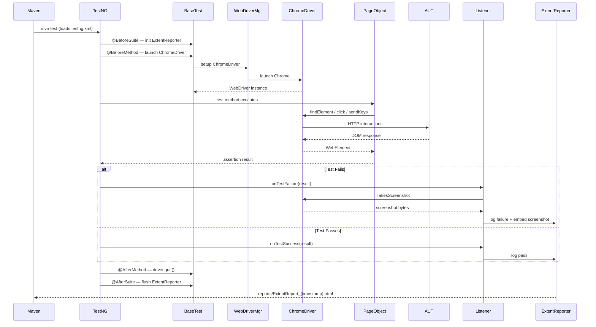

# Design Document

## YouTube UI Automation Framework

---

## Overview

This document describes the technical design for the YouTube UI Automation Framework targeting [https://www.youtube.com](https://www.youtube.com). The framework is built with **Java 11 + Selenium WebDriver 4.x**, **TestNG 7.x**, and the **Page Object Model (POM)** design pattern, and integrates with Kiro's AI-assisted engineering capabilities (Spec Mode, Steering, Hooks) to enforce coding standards and keep documentation in sync.

### Goals

- Provide a stable, demo-ready UI automation framework for YouTube's core user flows.
- Enforce separation of concerns between page interaction logic (Page Objects) and test logic (Test Classes).
- Support suite filtering (smoke/regression), retry logic, and rich HTML reporting.
- Keep all test data externalized — no hardcoded values in test or page classes.

### Technology Stack

| Concern | Technology |
|---|---|
| Language | Java 11 |
| Browser Automation | Selenium WebDriver 4.x |
| Driver Management | WebDriverManager (io.github.bonigarcia) |
| Test Framework | TestNG 7.x |
| Build Tool | Maven |
| Reporting | ExtentReports 5.x + Allure 2.x |
| Logging | Log4j2 |
| Test Data | JSON + `.properties` files |
| Property-Based Testing | jqwik 1.8.1 |
| Mocking | Mockito 5.11.0 |

### Design Principles

1. **Page Object Model** — one class per AUT page, encapsulating all locators and interaction methods.
2. **Explicit Waits** — `WebDriverWait` + `ExpectedConditions` for all synchronization; no `Thread.sleep()`.
3. **CSS-First Locators** — CSS selectors preferred; ARIA/ID as fallback; XPath only when no alternative exists.
4. **Externalized Test Data** — no hardcoded values in test or page classes; all data sourced from `testdata/`.
5. **Listener-Driven Reporting** — `ITestListener` integration with ExtentReports and screenshot capture.
6. **Retry on Transient Failure** — `IRetryAnalyzer` retries failed tests once (`MAX_RETRY_COUNT = 1`).
7. **Cookie Consent Handling** — `HomePage.dismissCookieConsent()` auto-dismisses region-specific dialogs before assertions.

---

## Architecture

### Component Diagram

```mermaid
graph TD
    subgraph TestNG["TestNG Execution Layer"]
        SUITE[testng.xml]
        LISTENER[TestNGListener<br/>ITestListener]
        RETRY[RetryAnalyzer<br/>IRetryAnalyzer]
    end

    subgraph Tests["Test Layer — src/test/java/tests/"]
        HT[HomeTest]
        ST[SearchTest]
        VT[VideoTest]
        NT[NavigationTest]
    end

    subgraph Base["Base Layer — src/test/java/base/"]
        BT[BaseTest<br/>@BeforeSuite / @AfterSuite<br/>@BeforeMethod / @AfterMethod<br/>BASE_URL]
    end

    subgraph Pages["Page Layer — src/test/java/pages/"]
        BP[BasePage<br/>waitForVisible / waitForClickable<br/>waitForPageLoad / waitForAngular]
        HP[HomePage]
        SRP[SearchResultsPage]
        VP[VideoPage]
    end

    subgraph Utils["Utility Layer — src/test/java/utils/"]
        WDM[WebDriverManager<br/>Driver Factory]
        SS[ScreenshotUtility]
        TDP[TestDataProvider]
        ER[ExtentReporter]
    end

    subgraph Data["Test Data — testdata/"]
        JSON[testdata.json]
        PROPS[config.properties]
    end

    subgraph Browser["Browser Layer"]
        WD[Selenium WebDriver<br/>ChromeDriver]
        AUT[AUT — youtube.com]
    end

    SUITE --> LISTENER
    SUITE --> Tests
    Tests --> BT
    BT --> WDM --> WD --> AUT
    Tests --> Pages
    Pages --> BP
    Pages --> WD
    LISTENER --> ER
    LISTENER --> SS
    Tests --> TDP --> Data
    RETRY -.->|retries| Tests
```

### Execution Flow



---

## Components and Interfaces

### BaseTest (`src/test/java/base/BaseTest.java`)

Root class for all test classes. Manages the WebDriver lifecycle and exposes `BASE_URL`.

| Member | Type | Description |
|---|---|---|
| `driver` | `WebDriver` | Public — accessible by `TestNGListener` for screenshots. |
| `wait` | `WebDriverWait` | 15 s default wait shared across test methods. |
| `BASE_URL` | `static final String` | Loaded from `testdata/config.properties` at class init. Currently `https://www.youtube.com`. |
| `@BeforeSuite` | `initSuite()` | Clears `screenshots/`, calls `ExtentReporter.init()`. Guard against double-init from multiple listeners. |
| `@BeforeMethod` | `setUp(Method)` | Reads `browser` system property, launches WebDriver via WebDriverManager, maximizes window. |
| `@AfterMethod` | `tearDown(ITestResult)` | Captures screenshot on failure, calls `ExtentReporter.endTest()`, quits driver. |
| `@AfterSuite` | `tearDownSuite()` | Calls `ExtentReporter.flush()`. |

---

### BasePage (`src/test/java/pages/BasePage.java`)

Shared base for all Page Objects. All page objects extend `BasePage`.

| Method | Signature | Description |
|---|---|---|
| `waitForVisible` | `WebElement waitForVisible(By)` | Waits up to 15 s for element visibility. |
| `waitForClickable` | `WebElement waitForClickable(By)` | Waits up to 15 s for element to be clickable. |
| `waitForVisibleLong` | `WebElement waitForVisibleLong(By)` | Waits up to 25 s — for slow-loading elements. |
| `waitForPageLoad` | `void waitForPageLoad()` | Waits for `document.readyState == "complete"`. |
| `waitForAngular` | `void waitForAngular()` | Waits for Angular HTTP calls to settle (no-op on non-Angular pages). |
| `pause` | `void pause(long millis)` | Safe sleep — use sparingly for render delays only. |
| `getPageTitle` | `String getPageTitle()` | Returns `driver.getTitle()`. |

---

### HomePage (`src/test/java/pages/HomePage.java`)

Page Object for `https://www.youtube.com`.

| Method | Signature | Description |
|---|---|---|
| `open` | `HomePage open(String baseUrl)` | Navigates to YouTube, waits for page load, dismisses cookie consent. |
| `dismissCookieConsent` | `void dismissCookieConsent()` | Clicks the reject/dismiss button on cookie dialogs (EU regions). No-op if dialog absent. |
| `getPageTitle` | `String getPageTitle()` | Returns the browser document title. |
| `isLogoVisible` | `boolean isLogoVisible()` | Returns `true` if the YouTube logo link is visible. |
| `isSearchBoxVisible` | `boolean isSearchBoxVisible()` | Returns `true` if the search input is visible. |
| `hasVideoThumbnails` | `boolean hasVideoThumbnails()` | Returns `true` if at least one video thumbnail is present. |
| `getVideoThumbnailCount` | `int getVideoThumbnailCount()` | Returns the count of visible video thumbnails. |
| `searchFor` | `SearchResultsPage searchFor(String query)` | Enters query in search box, clicks search button, returns `SearchResultsPage`. |
| `getCurrentUrl` | `String getCurrentUrl()` | Returns the current browser URL. |

**Locator strategy:**
- Search box: `By.cssSelector("input#search")`
- Search button: `By.cssSelector("button#search-icon-legacy")`
- Logo: `By.cssSelector("a#logo, ytd-logo a")`
- Video thumbnails: `By.cssSelector("ytd-rich-item-renderer, ytd-video-renderer")`
- Cookie reject button: `By.cssSelector("button[aria-label='Reject all'], button[aria-label*='Reject']")`

---

### SearchResultsPage (`src/test/java/pages/SearchResultsPage.java`)

Page Object for `/results?search_query=...`.

| Method | Signature | Description |
|---|---|---|
| `hasResults` | `boolean hasResults()` | Returns `true` if at least one `ytd-video-renderer` is present. |
| `getResultCount` | `int getResultCount()` | Returns the count of video result elements. |
| `getFirstVideoTitle` | `String getFirstVideoTitle()` | Returns the text of the first result's title element. |
| `firstResultTitleContains` | `boolean firstResultTitleContains(String keyword)` | Case-insensitive check of first result title. |
| `clickFirstResult` | `VideoPage clickFirstResult()` | Clicks the first video title, returns `VideoPage`. |
| `getPageTitle` | `String getPageTitle()` | Returns the browser document title. |
| `getCurrentUrl` | `String getCurrentUrl()` | Returns the current browser URL. |
| `urlContainsSearchQuery` | `boolean urlContainsSearchQuery(String query)` | Returns `true` if URL contains `search_query` or `results`. |
| `searchFor` | `SearchResultsPage searchFor(String query)` | Enters new query in search box and submits via ENTER key. |
| `hasChannelNames` | `boolean hasChannelNames()` | Returns `true` if channel name elements are present in results. |

**Locator strategy:**
- Video results: `By.cssSelector("ytd-video-renderer")`
- Video titles: `By.cssSelector("ytd-video-renderer #video-title")`
- Channel names: `By.cssSelector("ytd-video-renderer ytd-channel-name")`
- Search box: `By.cssSelector("input#search")`

---

### VideoPage (`src/test/java/pages/VideoPage.java`)

Page Object for `/watch?v=...`.

| Method | Signature | Description |
|---|---|---|
| `isVideoPlayerVisible` | `boolean isVideoPlayerVisible()` | Returns `true` if the HTML5 video player element is visible. |
| `getVideoTitle` | `String getVideoTitle()` | Returns the video title text. |
| `isVideoTitleVisible` | `boolean isVideoTitleVisible()` | Returns `true` if video title is non-empty. |
| `getChannelName` | `String getChannelName()` | Returns the channel name text. |
| `isChannelNameVisible` | `boolean isChannelNameVisible()` | Returns `true` if channel name is non-empty. |
| `isShareButtonVisible` | `boolean isShareButtonVisible()` | Returns `true` if the Share button is visible. |
| `hasRelatedVideos` | `boolean hasRelatedVideos()` | Returns `true` if at least one related video is in the sidebar. |
| `isDescriptionVisible` | `boolean isDescriptionVisible()` | Returns `true` if the description section is visible. |
| `isProgressBarVisible` | `boolean isProgressBarVisible()` | Returns `true` if the video progress bar is visible. |
| `isMuteButtonVisible` | `boolean isMuteButtonVisible()` | Returns `true` if the mute button is visible. |
| `pauseVideo` | `void pauseVideo()` | Pauses the video via JavaScript to prevent autoplay interference. |
| `urlContainsWatch` | `boolean urlContainsWatch()` | Returns `true` if current URL contains `/watch`. |
| `getCurrentUrl` | `String getCurrentUrl()` | Returns the current browser URL. |

**Locator strategy:**
- Video player: `By.cssSelector("video.html5-main-video, #movie_player")`
- Video title: `By.cssSelector("h1.ytd-watch-metadata yt-formatted-string, h1#title yt-formatted-string")`
- Channel name: `By.cssSelector("ytd-channel-name #channel-name a, #owner #channel-name a")`
- Related videos: `By.cssSelector("ytd-compact-video-renderer")`
- Progress bar: `By.cssSelector("div.ytp-progress-bar")`
- Mute button: `By.cssSelector("button.ytp-mute-button")`

---

### TestDataProvider (`src/test/java/utils/TestDataProvider.java`)

| Method | Signature | Description |
|---|---|---|
| `getData` | `String getData(String key)` | Returns value for key; throws `TestDataNotFoundException` if absent. |
| `hasKey` | `boolean hasKey(String key)` | Returns `true` if key exists in the data map. |
| `getLoginData` | `@DataProvider Object[][] getLoginData()` | Returns credential pairs for data-driven tests. |

**Data file:** `testdata/testdata.json`

```json
{
  "searchTermExisting": "Selenium WebDriver tutorial",
  "searchTermTrending": "Java programming",
  "searchTermShorts": "funny cats shorts",
  "searchTermMusic": "lofi hip hop",
  "searchTermNonExistent": "xyznonexistentvideo999abcdef123",
  "expectedHomeTitle": "YouTube",
  "expectedSearchResultsTitle": "Selenium WebDriver tutorial - YouTube"
}
```

---

### ExtentReporter (`src/test/java/utils/ExtentReporter.java`)

Thread-safe wrapper around ExtentReports 5.x. Uses `ThreadLocal<ExtentTest>` for parallel safety.

| Method | Description |
|---|---|
| `init()` | Creates `ExtentReports` instance with `ExtentSparkReporter`. Guard: no-op if already initialized. |
| `startTest(String)` | Creates a new `ExtentTest` node for the current thread. |
| `log(Status, String)` | Logs a step with the given status to the current thread's test node. |
| `embedScreenshot(String)` | Embeds screenshot path into the current test node. |
| `endTest(ITestResult)` | Marks test node pass/fail/skip based on TestNG result. |
| `flush()` | Writes HTML report to `reports/ExtentReport_{timestamp}.html`. |

---

### TestNGListener (`src/test/java/listeners/TestNGListener.java`)

Implements `ITestListener`. Registered in `testng.xml` via `<listeners>`.

| Callback | Action |
|---|---|
| `onTestStart` | Logs test start via Log4j2. |
| `onTestSuccess` | Logs pass to ExtentReporter. |
| `onTestFailure` | Captures screenshot via `ScreenshotUtility`, embeds in ExtentReporter, attaches to Allure, logs error. |
| `onTestSkipped` | Logs skip to ExtentReporter. |

---

### RetryAnalyzer (`src/test/java/utils/RetryAnalyzer.java`)

Implements `IRetryAnalyzer`. `MAX_RETRY_COUNT = 1` — each failing test gets one retry (two total executions). Referenced via `@Test(retryAnalyzer = RetryAnalyzer.class)` on every test method.

---

## Test Classes and Coverage

### 20 Test Cases Across 4 Classes

| Class | Test Method | Groups | Description |
|---|---|---|---|
| `HomeTest` | `testHomePageTitle` | smoke, regression | Page title contains "YouTube" |
| `HomeTest` | `testLogoIsVisible` | smoke, regression | YouTube logo is visible |
| `HomeTest` | `testSearchBoxIsVisible` | smoke, regression | Search box is visible |
| `HomeTest` | `testHomePageHasVideoThumbnails` | regression | At least one thumbnail present |
| `HomeTest` | `testHomePageUrl` | regression | URL contains "youtube.com" |
| `SearchTest` | `testSearchReturnsResults` | smoke, regression | Search returns at least one result |
| `SearchTest` | `testSearchResultsUrl` | smoke, regression | URL contains search_query param |
| `SearchTest` | `testSearchResultsPageTitle` | regression | Page title contains search term |
| `SearchTest` | `testSearchResultsHaveChannelNames` | regression | Channel names visible in results |
| `SearchTest` | `testSearchFromResultsPage` | regression | Re-search from results page works |
| `VideoTest` | `testVideoPlayerIsVisible` | smoke, regression | Video player element visible |
| `VideoTest` | `testVideoPageUrl` | smoke, regression | URL contains /watch |
| `VideoTest` | `testVideoTitleIsVisible` | regression | Video title is non-empty |
| `VideoTest` | `testChannelNameIsVisible` | regression | Channel name is non-empty |
| `VideoTest` | `testRelatedVideosAreShown` | regression | Related videos sidebar present |
| `NavigationTest` | `testDirectNavigationToHome` | smoke, regression | Direct nav loads YouTube home |
| `NavigationTest` | `testBackFromSearchResultsToHome` | regression | Back from search stays on youtube.com |
| `NavigationTest` | `testSearchThenOpenVideoChangesUrl` | regression | Search → video changes URL to /watch |
| `NavigationTest` | `testBackFromVideoToSearchResults` | regression | Back from video returns to results URL |
| `NavigationTest` | `testPageTitleUpdatesAfterSearch` | regression | Title changes after search |

---

## TestNG Suite Configuration

### `testng.xml` (Default — All Tests, No Parallelism)

```xml
<?xml version="1.0" encoding="UTF-8"?>
<!DOCTYPE suite SYSTEM "https://testng.org/testng-1.1.dtd">
<suite name="YouTube Automation Suite" parallel="none" verbose="1">

    <listeners>
        <listener class-name="listeners.TestNGListener"/>
    </listeners>

    <test name="Home Tests">
        <classes><class name="tests.HomeTest"/></classes>
    </test>
    <test name="Search Tests">
        <classes><class name="tests.SearchTest"/></classes>
    </test>
    <test name="Video Tests">
        <classes><class name="tests.VideoTest"/></classes>
    </test>
    <test name="Navigation Tests">
        <classes><class name="tests.NavigationTest"/></classes>
    </test>

</suite>
```

**Design decisions:**
- `parallel="none"` — YouTube tests are sequential to avoid session conflicts and rate limiting.
- Each test class is its own `<test>` block for cleaner reporting in ExtentReports and TestNG output.
- `TestNGListener` registered at suite level — active for all tests without per-class annotation.

---

## Correctness Properties

### Property 1: Home Page Title Contains "YouTube"

*For any* browser session navigating to `https://www.youtube.com`, `HomePage.getPageTitle()` SHALL return a non-empty string containing `"YouTube"`.

**Validates: Requirement 1.1**

---

### Property 2: Search Always Returns Results for Known Terms

*For any* non-empty search term from the known test data set, `SearchResultsPage.hasResults()` SHALL return `true` after calling `HomePage.searchFor(term)`.

**Validates: Requirement 2.1**

---

### Property 3: Search URL Contains Query Parameter

*For any* search performed via `HomePage.searchFor(term)`, the resulting URL SHALL contain `"search_query"` or `"results"`.

**Validates: Requirement 2.2**

---

### Property 4: Video Page URL Contains /watch

*For any* video result clicked via `SearchResultsPage.clickFirstResult()`, the resulting URL SHALL contain `"/watch"`.

**Validates: Requirement 3.1**

---

### Property 5: Video Title Is Non-Empty

*For any* video watch page loaded via `SearchResultsPage.clickFirstResult()`, `VideoPage.getVideoTitle()` SHALL return a non-empty string.

**Validates: Requirement 3.3**

---

### Property 6: Missing Key Throws TestDataNotFoundException

*For any* string `k` not present in `testdata.json`, calling `TestDataProvider.getData(k)` SHALL throw `TestDataNotFoundException` whose message contains `k`.

**Validates: Requirement 8.3**

---

### Property 7: RetryAnalyzer Retries Once Then Fails

*For any* test that fails on every attempt, `RetryAnalyzer.retry()` SHALL return `true` on the first invocation and `false` on the second, resulting in exactly one retry.

**Validates: Requirement 9.2**

---

### Property 8: Screenshot Captured and Embedded on Failure

*For any* test method that terminates with a failure status, a screenshot file SHALL exist in `screenshots/` with a filename containing the test name, and the ExtentReporter node SHALL contain a reference to that path.

**Validates: Requirement 6.2, 6.3**

---

## Error Handling

### Cookie Consent Dialog
`HomePage.dismissCookieConsent()` uses a 5-second `WebDriverWait` for the consent button. If the button is not found (no dialog), the exception is silently caught and execution continues. This prevents test failures in regions where no consent dialog appears.

### Timeout and Element Not Found
All Page Object methods use `WebDriverWait` with `ExpectedConditions`. On timeout, a `TimeoutException` is thrown. Page objects catch and return safe defaults (`false`, `""`, `0`) for boolean/string/int accessors to prevent test crashes on optional elements.

### Video Autoplay Interference
`VideoPage.pauseVideo()` executes `document.querySelector('video').pause()` via `JavascriptExecutor`. This is called before assertions on video metadata to prevent the player from navigating away or triggering overlays.

### Duplicate Listener Registration
`allure-testng` auto-registers via ServiceLoader. `ExtentReporter.init()` and `BaseTest.initSuite()` both guard against double-initialization using a `volatile boolean suiteInitialized` flag and a `extent != null` null-check respectively.

### Screenshot Capture Failure
`ScreenshotUtility.capture()` wraps the screenshot operation in try-catch. On failure, it logs at WARN level and returns `null` — screenshot failure must not mask the original test failure.

### Test Data Not Found
`TestDataProvider.getData(key)` throws `TestDataNotFoundException` (a `RuntimeException` subclass) immediately at test setup, surfacing the missing key before any browser interaction occurs.
